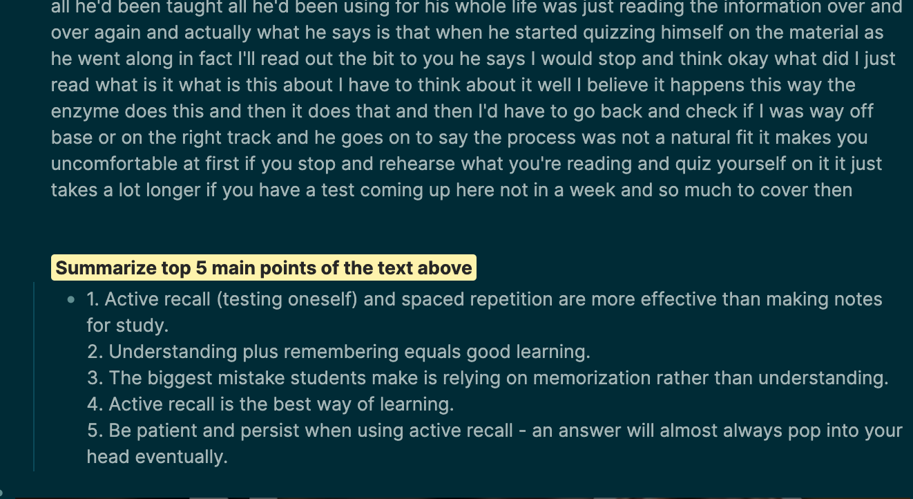
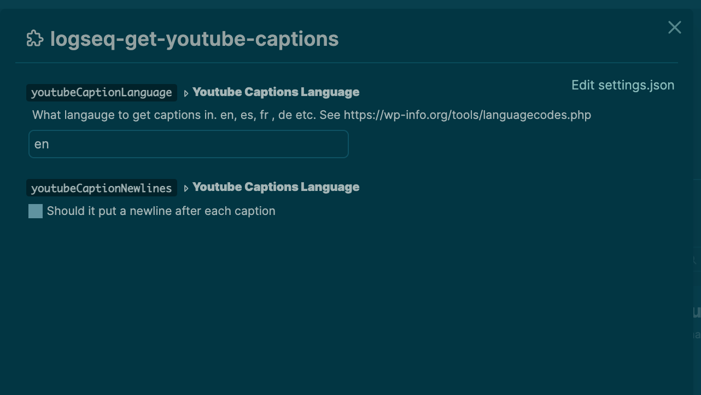

<p align="center">
  <a href="" rel="noopener">
</p>

<h3 align="center">logseq-get-youtube-captions</h3>

<div align="center">

[]()
[](https://github.com/briansunter/logseq-get-youtube-captions)
[](https://github.com/briansunter/logseq-get-youtube-captions)
[](/LICENSE)

</div>

---

<p align="center"> A plugin for downloading Youtube captions and subtitles from inside logseq
    <br>
</p>

## Usage

Just type `/get-youtube-captions` in a block or select `get-youtube-captions` from the block menu.

It finds the first youtube video in the block and downloads the captions.

Works with embedded {{video }} links and the different youtube video link formats.

It just inserts a big block of text in one block for now, but I plan to let users customize this more in future updates, like breaking the text up into smaller chunks based on timestamp.

It supports setting the caption language to download. It will display an error if the desired captions language is not available.

## Demo


### Summarize



I highly recommend combining this with my [logseq GPT3 OpenAI plugin](https://github.com/briansunter/logseq-plugin-gpt3-openai) for advanced text summarization, like getting the top 5 main points of a long video. There is a limit to the amount of text you can send, so you may need to break it up into chunks. Also, OpenAI is a bit expensive if you send it a lot of text. See if the [logseq-summarizer](https://github.com/trashhalo/logseq-summarizer) works for you as well. The summaries are simpler but the tool is free (unlike openai).

### Customize captions language to download



### Download captions in your language


## 📝 Table of Contents

- [About](#about)
- [Examples with GIFs](#examples)
- [Getting Started](#getting_started)
- [Deployment](#deployment)
- [Usage](#usage)
- [Built Using](#built_using)
- [TODO](../TODO.md)
- [Contributing](../CONTRIBUTING.md)
- [Authors](#authors)
- [Acknowledgments](#acknowledgement)

## About <a name = "about"></a>

`logseq-get-youtube-captions` allows users to download captions from YouTube video within the LogSeq editor.

Select a block with a youtube video link or embed in it.

Then run the open `get-youtube-captions` command via the slash or block menu. The plugin will download the captions and save them underneath the block.

## Getting Started <a name = "getting_started"></a>

- Download the plugin in the Logseq marketplace by searching for `get-youtube-captions`

## FAQ <a name = "faq"></a>

### I'm getting an error

Check the console for errors. There may not be subtitles available in a given language.

### Installing

```
npm i
```

## Running the tests <a name = "tests"></a>

- [ ] Add Tests
- [ ] Split up captions

## Build <a name="usage"></a>

```
npm run build
```

## 💻 Local Development

This enables the local dev server with hot reloading, via the logseq vite plugin.

```
npm i
npm run dev
```

### Prod build

First run `npm i` and `npm run build`

Open LogSeq

Go to Settings > Turn on Developer Mode

This will bring up the "Plugins" entry in three dots more menu list on the top right of the head bar. Go to Plugins page, and you will get a button with the  `Load unpacked plugin label`. Select the root folder of this plugin repo.

## 🚀 Deployment <a name = "deployment"></a>

Creates a build using semantic release when a commit is pushed with a smart commit message.

## Built Using <a name = "built_using"></a>

- [LogSeq](https://logseq.com/) - Privacy-first, open-source knowledge base that works on top of local plain-text Markdown and Org-mode files.
- [Vite](https://vitejs.dev/) - Next Generation Frontend Tooling

## Contributing <a name = "contributing"></a>

Do you have a bug or idea? I would love to hear from you! [Open a Github issue here.](https://github.com/briansunter/logseq-get-youtube-captions/issues/new)

PRs welcome. [Open an issue](https://github.com/briansunter/logseq-get-youtube-captions/issues/new) to discuss first if possible.

## Authors <a name = "authors"></a>

- [@briansunter](https://github.com/briansunter) - Author

# Follow me on Twitter!: [@bsunter](https://twitter.com/bsunter)
